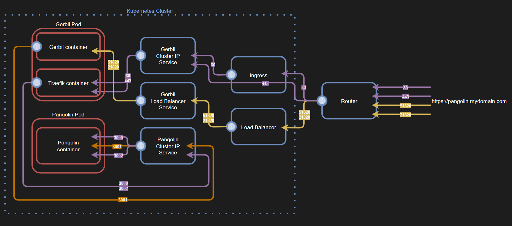

Unofficial Pangolin Helm chart



```bash
git clone https://github.com/XpaceOff/xo-pangolin.git
cd xo-pangolin

# Install example:
helm install pangolin xo-pangolin \
--set-string settings.pangolin.serverSecretKey=SECRET_KEY_HERE \
--set-string ingress.hostDomain="pangolin.test" \
--set-string volumes[0].name=vol-pangolin \
--set-string volumes[0].nfs.path=/volume/cluster/pangolin \
--set-string volumes[0].nfs.server=nas.lan

# Uninstall example:
helm uninstall pangolin
```
